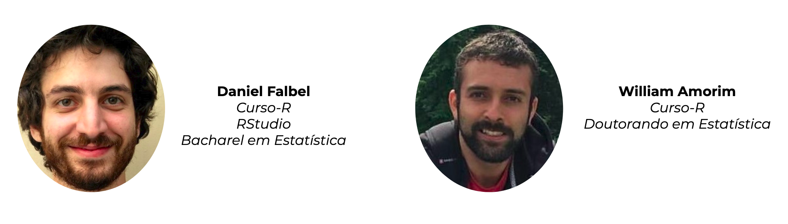
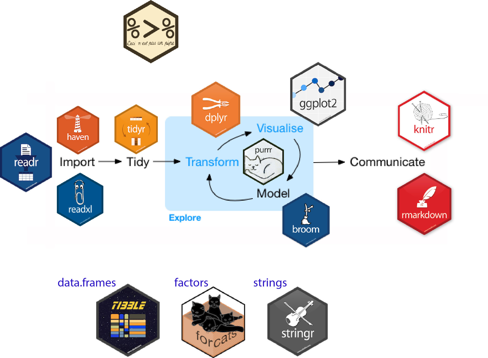

```{r setup, include=FALSE}
options(htmltools.dir.version = FALSE)
```

# Sobre nós



<br>


---

# Sobre a apresentação

* Essa apresentação é baseada na apresentação [*Should all statistics students be programmers?*](https://speakerdeck.com/hadley/should-all-statistics-students-be-programmers) do Hadley Wickham.


---
class: center, middle

# Todo estatístico deveria ser programador?

---
class: center, middle


---
class: center, middle

# Agora...

### Todo estatístico deveria programar?

---
class: center, middle


---
class: center, middle

O que o estatístico deveria saber fazer?

# Modelos?


---
class: center, middle

## O que o estatístico deveria saber fazer?


---
## O computador é a ferramenta do cientista de dados

<br>


---
## Ferramanta vs conhecimento

<br>

 

---
## Precisamos nos comunicar com o computador

 

---
## Point-click vs linguagens de programação

<br>

--

.pull-left[

]

--

.pull-right[

]

---
class: center, middle

### Por que programar é sempre preferível?

<br>

# 1. Código é texto
# 2. Código é legível
# 3. Código é aberto

---
class: middle, center, inverse

# Código é texto

---
class: middle, center

### Copiar & Colar 


---
### Copiar & Colar 

```
bd1 <- read_csv("base1.csv")
```

--

```
bd2 <- read_csv("base2.csv")
bd3 <- read_csv("base3.csv")
bd4 <- read_csv("base4.csv")
bd5 <- read_csv("base5.csv")
```

-- 

Sim! Essa é uma estratégia boa no começo!

---
class: middle, center

### Stack Overflow


---
class: middle, center, inverse

# Código é legível

---

```{r message=FALSE, warning=FALSE, include=FALSE}
library(magrittr)
library(magick)
library(ggplot2)
library(dplyr)
library(viridis)
```

```{r, eval = FALSE}
image_read("https://jeroen.github.io/images/frink.png") %>%
  image_rotate(270) %>%
  image_background("blue", flatten = TRUE) %>%
  image_border("red", "10x10") %>%
  image_annotate("Liguagens de programação ainda\nsão linguagens!", 
                 color = "white", size = 30)
```

--

.pull-left[

]

<!-- .pull-right[ -->
<!-- ```{r, eval = TRUE, echo = FALSE} -->
<!-- image_read("https://jeroen.github.io/images/frink.png") %>% -->
<!--   image_rotate(270) %>% -->
<!--   image_background("blue", flatten = TRUE) %>% -->
<!--   image_border("red", "10x10") %>% -->
<!--   image_annotate("Liguagens de programação ainda\nsão linguagens!",  -->
<!--                  color = "white", size = 30) -->
<!-- ``` -->
<!-- ] -->

---
class: middle, center

## Código te dá confiança de que está certo!


---

## Ahh, meu erro estava aqui!

```
bd1 <- read_csv("base1.csv")
bd2 <- read_csv("base2.csv")
bd3 <- read_csv("base3.csv")
bd4 <- read_csv("base4.csv")
*bd5 <- read_csv("base4.csv")
```

---
class: middle, center, inverse

# Código é aberto

---
class: middle, center


# Todas as linguagens de programação modernas são open-source

---

# Grátis

* Estudantes podem usar as mesmas ferramentas que os profissionais
* Todos podem usar as melhores ferramentas idenpendente do poder financeiro
* Qualquer um pode reproduzir as suas análises

---

# Aberto

* Você pode corrigir problemas
* Você pode desenvolver suas próprias ferramentas

---

# Por que usar o R?

---

## Ciclo da ciência de dados


---

## Ciclo da ciência de dados


---
class: middle, center, inverse

# Tidyverse

---
# Tidyverse

Coleção de pacotes com a mesma filosofia, gramática e estrutura de dados.

- Cada pacote contém funções para lidar um problema específico.
- Todos os pacotes são construídos para trabalharem bem com o operador pipe `%>%`.
- As funções de cada pacote têm nomes intuitivos e sintaxe parecida.
- Os pacotes do tidyverse nos incentivam a trabalhar com bases "tidy".

---
class: middle, center

# Tidyverse


